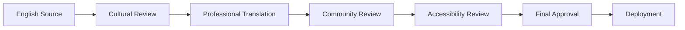

# Universal Design & Accessibility Standards

This document outlines Cathedral of Circuits' commitment to universal design principles and comprehensive accessibility standards that serve all users regardless of language, ability, neurodiversity, or assistive technology needs.

## 🌍 Multi-Language Support (i18n)

### Supported Languages (Phase 1)
- **English** (en) - Primary development language
- **Spanish** (es) - Español
- **French** (fr) - Français  
- **German** (de) - Deutsch
- **Portuguese** (pt) - Português
- **Italian** (it) - Italiano
- **Russian** (ru) - Русский
- **Mandarin Chinese** (zh-CN) - 中文（简体）
- **Japanese** (ja) - 日本語
- **Korean** (ko) - 한국어
- **Arabic** (ar) - العربية
- **Hindi** (hi) - हिन्दी

### Language Structure
```
/locales
  ├── en/
  │   ├── interface.json      # UI elements, buttons, navigation
  │   ├── arcana.json        # Major Arcana descriptions
  │   ├── safety.json        # Safety disclaimers & support
  │   ├── accessibility.json # Accessibility features text
  │   └── healing.json       # Healing protocol descriptions
  ├── es/
  │   ├── interface.json
  │   ├── arcana.json
  │   └── ...
  └── [language-code]/
```

### Translation Principles
- **Cultural Sensitivity**: Sacred concepts translated with respect for local spiritual traditions
- **Trauma-Informed**: Safety language culturally appropriate to each region
- **Neurodivergent Friendly**: Clear, direct language avoiding idioms or complex metaphors
- **Medical Disclaimers**: Legally appropriate for each jurisdiction
- **Inclusive Pronouns**: Gender-inclusive language where grammatically possible

## ♿ Comprehensive Accessibility Features

### Vision Accessibility
- **Screen Reader Optimization**: Full ARIA labeling and semantic HTML
- **High Contrast Modes**: Multiple contrast ratios (4.5:1, 7:1, 21:1)
- **Font Size Scaling**: 50% to 300% scaling without layout breaks
- **Color Independence**: No information conveyed by color alone
- **Focus Indicators**: Clear, high-contrast focus outlines
- **Alternative Text**: Descriptive alt text for all imagery and sacred geometry
- **Dark/Light Mode**: User preference with system detection

### Hearing Accessibility  
- **Visual Sound Indicators**: Visual representations of all audio cues
- **Closed Captions**: For any video or audio content
- **Sound Alternatives**: Haptic feedback options where available
- **Frequency Visualization**: Visual representations of Solfeggio frequencies
- **Volume Controls**: Fine-grained audio control with mute options

### Motor/Mobility Accessibility
- **Keyboard Navigation**: Full functionality without mouse/touch
- **Large Click Targets**: Minimum 44px touch targets
- **Gesture Alternatives**: Alternative inputs for all gesture-based interactions
- **Timing Controls**: User control over time-sensitive content
- **Motion Reduction**: Respect for prefers-reduced-motion
- **Voice Control**: Voice navigation support where possible

### Cognitive & Neurodivergent Support
- **Processing Time**: No rushed interactions or auto-advancing content
- **Memory Support**: Save states, bookmarks, progress indicators
- **Complexity Layers**: Information presented in digestible chunks
- **Multiple Learning Modes**: Visual, auditory, kinesthetic, and text-based options
- **Overwhelm Prevention**: Sensory overload controls and calm modes
- **Executive Function**: Clear navigation paths and task management
- **Attention Support**: Focus modes and distraction reduction

## 🧠 Neurodiversity-Specific Features

### ADHD Support
- **Focus Mode**: Minimal UI with single-task presentation
- **Time Awareness**: Optional time indicators and break reminders
- **Hyperfocus Protection**: Gentle interruptions for health breaks
- **Task Chunking**: Complex processes broken into manageable steps

### Autism Support  
- **Predictable Navigation**: Consistent UI patterns and behavior
- **Sensory Controls**: Adjustable visual/audio stimulation levels
- **Social Interaction Options**: Clear boundaries around social features
- **Routine Support**: Customizable interface layouts and workflows

### Dyslexia & Reading Differences
- **Dyslexic Fonts**: OpenDyslexic and other specialized font options
- **Reading Aids**: Line height, letter spacing, word spacing controls
- **Text-to-Speech**: High-quality TTS for all textual content
- **Visual Reading Supports**: Reading rulers, highlighting, contrast

### Memory & Cognitive Differences
- **Amnesia Support**: No punishment for forgetting, always helpful reminders
- **Cognitive Load**: Information density controls and simplification modes
- **Decision Support**: Clear options without overwhelming choice paralysis
- **Progress Preservation**: Never lose work or progress unexpectedly

## 🔧 Technical Implementation

### Internationalization (i18n) Stack
```javascript
// Technology choices
- react-i18next for React components
- i18next-browser-languagedetector for automatic language detection
- i18next-http-backend for loading translation files
- ICU message format for complex pluralization and formatting
- RTL (right-to-left) support for Arabic and Hebrew
```

### Accessibility Stack
```javascript
// WCAG 2.1 AA+ compliance tools
- @axe-core/react for automated accessibility testing
- react-aria for accessible component patterns  
- focus-trap-react for keyboard navigation management
- react-helmet-async for dynamic page titles and landmarks
- Web Speech API for text-to-speech functionality
```

### Responsive Design
- **Mobile First**: Designed for touch and small screens initially
- **Progressive Enhancement**: Enhanced features for capable devices
- **Bandwidth Awareness**: Efficient loading for limited connections
- **Offline Capability**: Core functionality works without internet

## 🎨 Cultural & Spiritual Sensitivity

### Sacred Symbol Respect
- **Cultural Context**: Sacred symbols presented with appropriate reverence
- **Traditional Attribution**: Proper acknowledgment of cultural origins
- **Adaptation Boundaries**: Clear limits on modification of sacred content
- **Community Consultation**: Input from cultural practitioners where possible

### Healing Approach Diversity
- **Multiple Traditions**: Space for various healing and spiritual approaches
- **No Appropriation**: Careful distinction between inspiration and appropriation
- **Personal Boundaries**: Users control their level of spiritual engagement
- **Secular Options**: Non-spiritual alternatives for all features

## 📱 Platform Accessibility

### Web Accessibility
- **WCAG 2.1 AAA**: Exceeding minimum standards where possible
- **Section 508**: US federal accessibility compliance
- **EN 301 549**: European accessibility standard compliance
- **AODA**: Accessibility for Ontarians with Disabilities Act compliance

### Mobile Accessibility  
- **iOS VoiceOver**: Full compatibility with Apple's screen reader
- **Android TalkBack**: Full compatibility with Google's screen reader
- **Switch Control**: Support for external switch navigation
- **Voice Control**: Compatible with voice navigation systems

### Assistive Technology
- **Screen Readers**: JAWS, NVDA, VoiceOver, TalkBack optimization
- **Voice Recognition**: Dragon NaturallySpeaking compatibility
- **Eye Tracking**: Support for eye-gaze navigation systems
- **Switch Navigation**: Single and multiple switch input support

## 🔍 Testing & Validation

### User Testing Groups
- **Disabled User Community**: Regular testing with actual users
- **Neurodivergent Testers**: ADHD, autism, dyslexia, and other communities
- **Cultural Consultants**: Native speakers and cultural practitioners
- **Elderly Users**: Age-related accessibility needs
- **Low-Tech Users**: Limited device and internet access scenarios

### Automated Testing
- **Accessibility Scanners**: axe, WAVE, Lighthouse accessibility audits
- **Color Contrast**: Automated contrast ratio verification
- **Keyboard Navigation**: Automated tab order and focus testing
- **Screen Reader**: Automated screen reader interaction testing
- **Performance**: Loading time optimization for accessibility tools

### Manual Testing Protocols
- **Navigation Testing**: Keyboard-only navigation verification
- **Screen Reader Testing**: Manual testing with multiple screen readers
- **Cognitive Load**: Task completion time and error rate analysis
- **Cultural Review**: Cultural appropriateness and sensitivity review

## 📚 Documentation Accessibility

### Multi-Format Documentation
- **Plain Text**: Simple, accessible text versions
- **Large Print**: High-contrast, large-font versions
- **Audio**: Spoken versions of all documentation
- **Video**: Sign language interpretation where needed
- **Easy Read**: Simplified language versions for cognitive accessibility

### Translation Workflow


## 🌟 Implementation Roadmap

### Phase 1: Foundation (Months 1-3)
- [ ] Core accessibility infrastructure
- [ ] English accessibility optimization
- [ ] Basic i18n framework setup
- [ ] Priority language translation start (Spanish, French)

### Phase 2: Expansion (Months 4-6)
- [ ] Additional language support (German, Portuguese, Italian)
- [ ] Advanced accessibility features
- [ ] Neurodivergent-specific customizations
- [ ] Mobile accessibility optimization

### Phase 3: Enhancement (Months 7-12)
- [ ] Full 12-language support
- [ ] Community translation system
- [ ] Advanced assistive technology integration
- [ ] Cultural adaptation beyond translation

### Phase 4: Community (Year 2+)
- [ ] Community-driven translations
- [ ] Regional cultural adaptations
- [ ] Advanced personalization features
- [ ] Research partnerships with accessibility organizations

## 💡 Innovation Areas

### Emerging Technologies
- **AI-Powered Descriptions**: Auto-generated alt text for sacred geometry
- **Haptic Feedback**: Tactile representations of visual elements
- **Spatial Audio**: 3D audio positioning for navigation
- **Brain-Computer Interfaces**: Future compatibility with neural interfaces

### Research Collaborations
- **Accessibility Organizations**: Partnership with disability rights groups
- **Academic Institutions**: Research on trauma-informed digital design
- **Cultural Organizations**: Collaboration with spiritual and cultural communities
- **Technology Companies**: Integration with emerging assistive technologies

## 📞 Support & Feedback

### Accessibility Feedback Channels
- **Direct Email**: accessibility@cathedral-project.org
- **GitHub Issues**: Tagged with `accessibility` label
- **Community Forums**: Dedicated accessibility discussion spaces
- **User Testing**: Paid participation opportunities for disabled users

### Translation Contributions
- **Community Portal**: Translation contribution platform
- **Cultural Review**: Community-driven cultural sensitivity review
- **Quality Assurance**: Native speaker review processes
- **Attribution**: Recognition for translation contributors

---

**Universal Design Principle**: We design for the margins, knowing that what helps the most vulnerable users creates a better experience for everyone.

*"The goal is not just compliance, but genuine inclusion and empowerment for all users."* 🌍✨