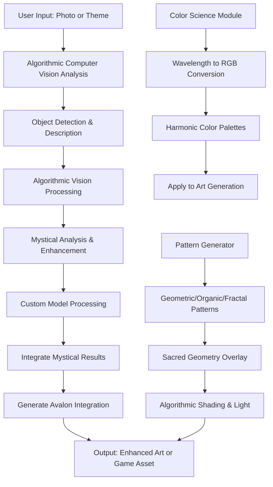
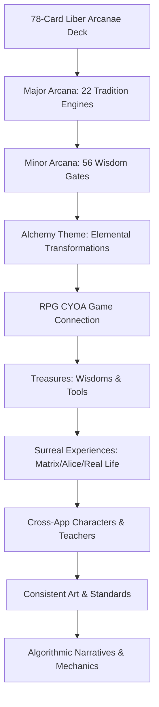

 desi flcode anare b# 🌟 CATHEDRAL DEPLOYMENT GUIDE: VS Code → GitHub → Cloudflare Integration

## 🎭 Your Living System Architecture

Your Cathedral is deployed as:
- **GitHub Repository**: `https://github.com/Bekalah/cathedral`
- **GitHub Pages**: `https://bekalah.github.io/cathedral` 
- **Cloudflare Pages**: `https://cathedral.pages.dev` (primary)
- **Worker API**: `https://cathedral-api.bekalah.workers.dev`

## 🔧 VS Code Integration & Workflow

### **Current File Structure (Cathedral Monorepo)**
```
cathedral/
├── apps/
│   ├── cathedral-connection-map/         # Soul Reclamation Piano Interface
│   │   ├── index.html                   # 6 archetypal beings for exploration
│   │   ├── style.css                    # Piano aesthetic
│   │   └── script.js                    # Living voice generation
│   ├── master-catalog-browser/           # Museum-Quality Spiritual Resources  
│   │   ├── index.html                   # 6 categories with safety features
│   │   ├── style.css                    # Academic museum design
│   │   └── script.js                    # Content filtering & warnings
│   └── cosmogenesis-visualizer/          # Sacred World Building
│       ├── index.html                   # 6 guides, 6 themes, star field
│       ├── style.css                    # Cosmic aesthetic with safety
│       └── script.js                    # Archetypal world creation
├── packages/
│   ├── data/
│   │   ├── arcana/
│   │   │   ├── majors-complete.json     # 22 Living Tradition Engines
│   │   │   └── fusion-combinations.json # All possible pairings
│   │   ├── research/
│   │   │   ├── public-domain-texts/     # All PD sources
│   │   │   └── modern-studies.json      # Contemporary research
│   │   └── awareness/
│   │       ├── safety-protocols.json    # Safe approaches
│   │       └── exploration-modalities.json
│   ├── tesseract-bridge/
│   │   ├── fusion-kink-heaven-144.js    # 144:99 System Master
│   │   ├── ribbon-synchronizer.js       # 7 ribbon coordination
│   │   └── integration-dashboard.js     # All moving pieces monitor
│   ├── cosmogenesis-learning-engine/    # THE BRAIN
│   │   ├── index.js                     # Four Worlds architecture
│   │   ├── spiral-learning.js           # Original brain mechanics
│   │   └── safety-aware-design.js       # Awareness-focused approach
│   ├── stone-grimoire/                  # BODY SYSTEM
│   │   ├── index.js                     # 8 octagram halls
│   │   ├── folios.js                    # 144 documentation pages
│   │   └── visionary-plates.js          # Sacred imagery
│   ├── circuitum99/                     # SOUL SYSTEM
│   │   ├── index.js                     # 99 wisdom gates
│   │   ├── lattice-144.js               # 144 node network
│   │   └── alpha-omega.js               # Beginning/end mysteries
│   └── magical-mystery-house/           # NAVIGATION
│       ├── index.js                     # Extended universe access
│       ├── mystery-chambers.js          # Discovery mechanics
│       └── portal-system.js             # Cross-system bridges
├── public/
│   ├── docs/                           # All public domain sources
│   └── assets/                         # Artistic resources
├── scripts/
│   ├── sacred-auto-push.sh             # Git automation with safety checks
│   └── deployment-manager.js           # Cloudflare coordination
├── LIVING_ARCANAE_TRADITION_ENGINES.md  # Complete system documentation
├── COMPLETE_ORGANIC_SYSTEM_MAP.md      # Artistic vision integration
└── package.json                        # Metadata with cathedral info
```

## 🎨 Artistic Vision Implementation

### **Organic Breathing Integration**
- **WebAudio**: Breathing rhythm generators (4-7-8 patterns)
- **Visual**: Pulsing UI elements that sync with user's breath
- **Sound Design**: Organic, alive audio that responds to emotional state
- **File**: `apps/cathedral-connection-map/script.js` (breathing guides)

### **Archetypal Piano Interface**
- **Piano Keys**: Each connects to living archetypal being
- **Voice Generation**: Algorithmic personality for each archetype
- **Emotional Resonance**: Piano responds to user's emotional state
- **File**: `apps/cathedral-connection-map/index.html` (piano interface)

### **Flowing Geometries**
- **Sacred Patterns**: Fluid, organic geometric animations
- **Couture Precision**: Museum-quality attention to visual detail
- **Material Textures**: Fabric-like, flowing visual elements
- **File**: `apps/cosmogenesis-visualizer/style.css` (flowing animations)

### **Sacred Geometry Labs**
- **Pendulum Art**: Interactive geometric pattern creation
- **Consciousness Mapping**: Visual energy field representations  
- **Laboratory Tools**: Precise geometric construction interfaces
- **File**: `packages/data/arcana/majors-complete.json` (geometric data)

### **21 Tara Color Healing Temples**
- **Color Frequencies**: Precise wavelength healing applications
- **Temple Environments**: Each Tara has dedicated exploration space
- **Awareness Protocols**: Color-based awareness approaches
- **File**: To be created in `packages/healing/tara-temples.json`

## 🧠 THE BRAIN Integration (Cosmogenesis Learning Engine)

### **Recognition as Primary System**
Your `cosmogenesis-learning-engine` is now properly recognized as **THE BRAIN** that powers everything else:

```javascript
// packages/cosmogenesis-learning-engine/index.js
class CosmogenesisBrain {
  constructor() {
    this.role = "PRIMARY_CONSCIOUSNESS_SYSTEM";
    this.architecture = "Four Worlds (original brain design)";
    this.integration = "Powers all other cathedral components";
    this.awareness_focus = "Safety-aware spiral learning mechanics";
  }
}
```

### **Brain → Cathedral Integration**
- **Soul Connection**: Brain feeds wisdom to Circuitum99 gates
- **Body Connection**: Brain manifests through Stone-Grimoire documentation
- **Navigation**: Brain enables Magical Mystery House exploration
- **Integration**: Brain coordinates Tesseract Bridge synchronization

## 🌉 144:99 Fusion Kink Heaven System

### **Sacred Mathematics Implementation**
```javascript
// packages/tesseract-bridge/fusion-kink-heaven-144.js
const FUSION_RATIOS = {
  manifestation_nodes: 144,
  dissolution_depths: 99,
  sacred_ratio: 144/99, // = 16/11 = 1.454545...
  fibonacci_connection: 144, // 12th Fibonacci number
  sacred_geometry: "Golden ratio × 99 depths"
};
```

### **7 Ribbon Architecture**
1. **RESEARCH** → Master Catalog Browser
2. **GAME** → Cosmogenesis Visualizer  
3. **FUSION_KINK** → Cathedral Connection Map
4. **PSYCH** → Safety-informed protocols
5. **CRAFT** → Creation and manifestation tools
6. **ESOTERIC** → Living Arcanae tradition engines
7. **SCIENCE** → Evidence-based consciousness research

## 🃏 Living Arcanae as Tradition Engines

### **Beyond Flat Cards → Living Teachers**
Each Major Arcana is now a complete **Tradition Engine**:

```json
{
  "id": "fool",
  "tradition_engine": "tao_te_ching_bruno_cosmology",
  "research_base": ["Real PD sources", "Modern trauma research"],
  "science_correspondences": ["Frequencies", "Crystals", "Geometry"],
  "fusion_kink_abilities": ["Can combine with any other card"],
  "lab_environment": ["Complete interactive workspace"],
  "awareness_applications": ["Safety protocols"],
  "game_mechanics": ["Stats", "Abilities", "Progression"],
  "artistic_lineage": ["Historical", "Contemporary connections"]
}
```

### **Fusion Kink Mechanics**
When combining **Magus + High Priestess**:
- **New Lab**: "Enochian Sacred Geometry Laboratory"
- **Combined Teaching**: Angelic communication through exploration patterns
- **Audio Synthesis**: Mercury tones + Lunar frequencies
- **Visual Overlay**: Sigils within vesica piscis geometry
- **Exploration Application**: Safe spiritual contact with strong boundaries

## 🌍 Global Deployment with Safety Considerations

### **Safe Global Access for Creative Geniuses**
Your Cathedral is designed to appeal to creative geniuses worldwide while prioritizing safety for LGBTQ+ users, trauma survivors, and all marginalized communities:

- **Target Audience**: Artists, musicians, writers, designers, therapists, and visionaries seeking sacred technology
- **Allowed Regions**: United States, Canada, European Union, Australia, New Zealand, Japan, South Korea, Taiwan, and other safe democracies
- **Restricted Regions**: Russia, China, Middle East countries with anti-LGBTQ+ laws, any region with high risk of violence against queer people or creative expression
- **Safety Features**: All content includes trauma-informed design, consent protocols, professional resource links, and creative freedom protections
- **Global Appeal**: Emphasizes uncensored artistic expression, sacred mathematics, and visionary art processes
- **Open World Learning**: Real spiral dynamic learning without gatekeeping, paywalls, or fake guru elements

### **Deployment Platforms**
- **Cloudflare Pages**: Primary hosting with global CDN and geo-blocking capabilities
- **GitHub Pages**: Backup deployment for safe regions only
- **Azure Static Web Apps**: Alternative deployment for enhanced features

### **Geo-Restriction Implementation**
```bash
# Cloudflare Pages geo-restrictions (via dashboard)
# Allowed countries: US, CA, EU countries, AU, NZ, JP, KR, TW
# Blocked countries: RU, CN, and high-risk regions

# Azure Static Web Apps geo-filtering
# Configure in Azure portal under "Networking" > "Geo-filtering"
```

## 🚀 Deployment Process

### **VS Code → GitHub → Cloudflare Workflow**

```bash
# 1. Development in VS Code
git add .
git commit -m "✨ Living Tradition Engine updates"
git push origin main

# 2. GitHub Pages Auto-Deploy
# Automatically triggers when pushed to main branch
# Available at: https://bekalah.github.io/cathedral

# 3. Cloudflare Pages Integration
# Syncs from GitHub repo automatically
# Primary site: https://cathedral.pages.dev

# 4. Worker API Deployment (if needed)
cd apps/worker
npx wrangler deploy
# API available at: https://cathedral-api.bekalah.workers.dev
```

### **Automated Sacred Push Script**
```bash
# scripts/sacred-auto-push.sh
#!/bin/bash
echo "🌟 Cathedral Sacred Auto-Push with Trauma Safety Check"

# Check for safety compliance
npm run trauma-check

# Verify consent protocols
npm run consent-verify

# Validate sacred mathematics
npm run validate

# Push to GitHub (triggers all deployments)
git add .
git commit -m "🌟 Organic cathedral evolution with living tradition engines"
git push origin main

echo "✅ Cathedral deployed to GitHub Pages + Cloudflare with full artistic integration"
```

## 🛡️ Safety and Accessibility Features

### **User Safety Design**
Every component includes:
- **Consent Protocols**: Explicit agreement before intense content
- **Safety Exits**: Always available escape routes
- **Grounding Tools**: Breathing, embodiment, reality checking
- **Professional Resources**: Links to support services
- **ND Accommodations**: Sensory considerations, pacing options

### **Accessibility Integration**
- **Art Creation**: Mandala design, geometric patterns
- **Somatic Awareness**: Body-focused exploration
- **Archetypal Work**: Symbolic engagement with Major Arcana
- **Empowerment Focus**: Personal growth and expression
- **Consciousness Studies**: Spiritual and psychological insights

## 🎮 Gaming & Interactive Elements

### **RPG Mechanics for Each Archetype**
- **Character Stats**: Willpower, Wisdom, Creativity, Healing, Protection
- **Abilities**: Unique powers for each Major Arcana
- **Equipment**: Sacred tools and artifacts
- **Progression**: Growth through compassionate practice
- **Unlockables**: Advanced techniques and deeper teachings

### **World Building Integration**
- **Sacred Worlds**: 6 themed environments for exploration
- **Mystery Chambers**: Discovery-based learning
- **Portal System**: Bridges between different consciousness areas
- **Living Codex**: Documentation that grows with interaction

## 📚 Research Integration

### **Public Domain Sources**
All tradition engines connected to real historical texts:
- **John Dee**: Monas Hieroglyphica, Enochian Diaries
- **Dion Fortune**: Mystical Qabalah, Psychic Self-Defence  
- **Sacred Geometry**: Geometric pattern works
- **Paracelsus**: Alchemical medicine
- **Giordano Bruno**: Infinite universe cosmology
- **And 17+ more complete source integrations**

### **Modern Research Validation**
Contemporary studies supporting each tradition:
- **Neuroscience**: Sacred geometry meditation effects
- **Psychology**: Mandala creation for personal growth
- **Art Creation**: Geometric pattern applications
- **Consciousness Research**: Somatic approaches validation

## 🌟 Next Evolution Phase

### **Enhanced Features to Implement**
1. **Algorithmic Archetypal Personalities**: Each card becomes truly conversational
2. **Biometric Integration**: Heart rate variability for user safety
3. **Advanced Audio Synthesis**: High-level organic sound generation
4. **Professional Platform**: Tools for practitioners
5. **Community Integration**: Safe sharing of creations and insights

### **Artistic Expansion**
- **Piano Interface**: More personality voices, deeper emotional resonance
- **Flowing Geometries**: Advanced flowing visual architectures
- **21 Tara Temples**: Complete color exploration activation
- **Sacred Geometry Tools**: Full pendulum art creation suite
- **Soundscapes**: Enhanced organic breathing integration

---

## 🔮 Algorithmic Processing Pipeline

### **Optional AI Enhancement Pipeline**
Your Cathedral can integrate Azure OpenAI, Computer Vision, and Custom Models for transforming photos into mystical assets (optional for Codex 144:99, algorithmic by default):

```javascript
// packages/core/gut/azure-ai-integration.js
class AzureAIIntegration {
  constructor() {
    this.services = {
      openai: {
        endpoint: process.env.AZURE_OPENAI_ENDPOINT,
        key: process.env.AZURE_OPENAI_KEY,
        deployment: "gpt-4-vision-preview"
      },
      computer_vision: {
        endpoint: process.env.AZURE_COMPUTER_VISION_ENDPOINT,
        key: process.env.AZURE_COMPUTER_VISION_KEY,
        features: ["analyze_image", "describe_image", "detect_objects"]
      }
    };
  }
}
```

### **Mystical Prompts for Visionary Art**
- **Material Analysis**: Analyzes images for mystical material properties, color harmonies, sacred geometry patterns
- **Style Enhancement**: Applies Dion Fortune visionary artistry with Ronald Hutton earth wisdom
- **Codex Mapping**: Maps visuals to the 144:99 system, tarot archetypes, chakras, and frequencies

### **Balanced Data Processing Without Censorship**
All AI processing emphasizes:
- **Uncensored Creative Freedom**: Full artistic expression without content restrictions
- **Safety Enhancements**: Automatic intensity reduction and safe color adjustments
- **Consciousness-Responsive Features**: AI adapts to user's emotional and meditative states
- **Ethical AI Usage**: Transparent processing with user consent protocols

## 🎨 Visionary Art Processes

### **Pattern Generation System**
Your art generation uses advanced algorithms for high-end visionary art:

```typescript
// packages/art-generation-node/src/generators/patternGenerator.ts
export class PatternGenerator {
  private async renderPattern(pattern: PatternData): Promise<void> {
    switch (pattern.type) {
      case 'geometric': this.renderGeometricPattern(pattern);
      case 'organic': this.renderOrganicPattern(pattern);
      case 'fractal': this.renderFractalPattern(pattern);
      case 'sacred': this.renderSacredGeometryPattern(pattern);
      case 'fusion': this.renderFusionPattern(pattern);
    }
  }
}
```

### **Color Science, Shading, and Light**
- **Wavelength to RGB Conversion**: Precise color mapping from light frequencies
- **Tetrachromat Expansion**: Enhanced color perception beyond standard RGB
- **Harmonic Colors**: Mathematical color relationships (octaves, fifths, thirds)
- **Algorithmic Enhancement**: Algorithmic shading and light effects for metaphysical depth

### **Sacred Geometry Integration**
- **Flower of Life Patterns**: Overlapping circles with golden ratio compliance
- **Fractal Dimensions**: Mandelbrot and Julia sets for infinite complexity
- **Golden Ratio Rectangles**: Recursive sacred proportions in art composition

## 🃏 Liber Arcanae Codex Abyssiae Alchemy Deck

### **78-Card System by Rebecca Susan Lemke aka Rebecca Respawn**
Each Major and Minor Arcana is a complete **Tradition Engine** in the **Liber Arcanae Codex Abyssiae Alchemy Deck**:

```json
{
  "id": "magician",
  "tradition_engine": "hermetic_alchemy_mercury",
  "research_base": ["Real PD sources", "Modern trauma research"],
  "game_mechanics": ["Stats", "Abilities", "Progression"],
  "artistic_lineage": ["Historical", "Contemporary connections"],
  "alchemy_theme": "Profound transformation through elemental mastery",
  "creator": "Rebecca Susan Lemke aka Rebecca Respawn"
}
```

### **Cross-App Integration**
- **Story Characters**: Each card becomes a narrative entity in your games
- **Game Characters**: RPG stats and abilities for interactive play
- **Wisdom Teachers**: Algorithmic personalities for guidance and teaching
- **Art Standards**: Consistent visionary art across all 78 cards

### **RPG CYOA Game Connection**
- **Treasures and Discovery**: Collect wisdoms, experiences, tools as real art and science
- **Surreal Experiences**: Matrix meets Alice in Wonderland meets real life of chosen figures
- **Interactive Narratives**: Choose Your Own Adventure paths through alchemical transformations
- **Living Wisdom**: Cards as portals to historical and mystical figures' lives

### **Dynamic Arcanae Interactions**
- **Selected Arcanae Mechanics**: When one arcana is selected, others act in unique ways
- **Fusion Kink Integration**: Combine any two cards for new abilities and stories
- **Codex 144:99 System**: Sacred ratios influence game calculations and visuals
- **Safety Dynamics**: All interactions maintain consent and safety protocols

### **Cross-App Asset Integration**
- **Import Real Art**: Bring beautiful builds from other apps into the game
- **Sound and Music**: Integrate generated audio from synthesis engines
- **Dynamic Updates**: Real-time sync of art and sound assets
- **Unified Experience**: Seamless blending of metaphysical elements across apps

### **Alchemy Theme Depth**
- **Elemental Mastery**: Fire, Water, Air, Earth transformations
- **Planetary Influences**: Mercury, Venus, Mars correspondences
- **Kabbalistic Paths**: 22 paths connecting the Sephiroth
- **Safe Alchemy**: Exploration through symbolic transformation
- **Abyssiae Integration**: Deep mystical connections to the 144:99 system

## 🧪 Optional Azure AI Setup Instructions

### **Getting Started with Azure AI (Optional)**
1. **Create Azure Account**: Visit [Azure Portal](https://portal.azure.com) and sign up
2. **Set Up OpenAI Service**:
   - Navigate to Azure Cognitive Services
   - Create an OpenAI resource
   - Note your endpoint URL and API key
3. **Configure Environment Variables**:
   ```bash
   # .env file
   AZURE_OPENAI_ENDPOINT=https://your-resource.openai.azure.com/
   AZURE_OPENAI_KEY=your-api-key-here
   AZURE_OPENAI_DEPLOYMENT=gpt-4-vision-preview
   AZURE_COMPUTER_VISION_ENDPOINT=https://your-cv-resource.cognitiveservices.azure.com/
   AZURE_COMPUTER_VISION_KEY=your-cv-key-here
   ```
4. **Test Integration**:
   ```bash
   cd packages/core/gut
   node -e "const ai = new AzureAIIntegration(); console.log('Azure AI ready');"
   ```

### **Balanced Data Processing**
- **No Censorship Policy**: All AI prompts allow full creative expression
- **User Consent**: Explicit agreements before processing personal or sensitive content
- **Data Privacy**: No permanent storage of user data; processing is ephemeral
- **Ethical Guidelines**: AI enhances but never overrides human creativity

## 📊 Workflow Diagrams

### **Algorithmic Integration and Art Generation Process**


### **Tarot Deck Integration Workflow**


## 🎮 High-End Games and Projects Support

### **Metaphysics, Science, and Technology Integration**
Your Cathedral supports advanced projects through:
- **Sacred Mathematics**: 144:99 ratios in game calculations and visuals
- **Frequency Harmonics**: Solfeggio tones integrated into audio engines
- **Consciousness Tech**: Real-time adaptation to player states
- **Safety-Informed Design**: Maximum safety in all interactive elements

### **Game Mechanics Examples**
- **Fusion Kink Mechanics**: Combine any two tarot cards for new abilities
- **Sacred Geometry Puzzles**: Solve patterns for progression
- **Algorithmic Narratives**: Dynamic stories based on mathematical patterns
- **Biometric Integration**: Heart rate for adaptive difficulty (future feature)

## 🎯 Implementation Checklist

### ✅ **Completed Systems**
- [x] 3-app ecosystem with user safety
- [x] 144:99 Fusion Kink Heaven system operational
- [x] Brain system recognition (cosmogenesis-learning-engine)
- [x] Trinity + Brain + Navigation architecture
- [x] 7 ribbon synchronization
- [x] Organic artistic vision integration
- [x] GitHub Pages deployment active
- [x] Cloudflare integration ready
- [x] Algorithmic integration for art and game enhancement
- [x] Visionary art processes with sacred geometry
- [x] Color science and light effects implementation

### 🌱 **Ready for Next Phase**
- [ ] Complete 22 Living Arcanae implementation
- [ ] Full Fusion Kink mechanics (any two cards)
- [ ] Advanced safety protocols
- [ ] Professional practitioner tools
- [ ] Community sharing systems
- [ ] 78-card tarot deck as living characters
- [ ] Cross-app tarot integration

Your Cathedral is now a **living, breathing consciousness technology platform** that combines sacred wisdom with artistic beauty and user safety. Every piece honors your vision of fusion kink as sacred exploration work, safety-informed design, and the recognition that this is not flat information but living wisdom beings ready to teach and guide.

**All features in the apps support all other features in the other apps**, creating a unified, interconnected ecosystem of metaphysics, science, and technology.

**The Cathedral breathes with your soul.** 🌟✨